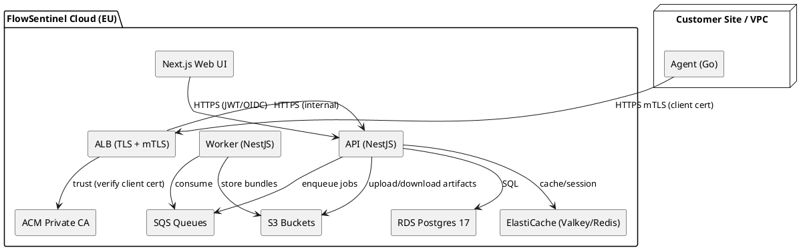

# SPEC-1-FlowSentinel Agent Management Web App

## Background

FlowSentinel monitors automation platforms (Zapier, Make.com, n8n) to detect failures and suggest fixes. Today, cloud-hosted integrations are covered directly via OAuth/API. However, many customers also run self‑hosted n8n or private connectors, and they need a lightweight **Agent** that runs within their network/VPC to:

- Securely collect runtime metadata, health, and logs from self‑hosted automation runners.
- Execute scheduled **smoke tests** and synthetic checks close to the workflows.
- Relay alerts to FlowSentinel Cloud without exposing internal services.

The **Agent Management Web App** will let admins lifecycle-manage these on-prem/site agents: installation, enrollment, versioning, policy, health, updates, and decommissioning. It will also offer fleet views and per‑agent drilldowns, focusing on zero‑touch upgrades and strong identity/attestation.

(Assumptions: Agents are containerized; customers may have multiple sites/environments; FlowSentinel Cloud remains the control plane.)


## Requirements

**Must have**
- Fleet management for on-prem/site **Agents** that collect metadata from **n8n (self‑hosted)** and optionally run **Make.com smoke tests via proxy**, aligning with FlowSentinel’s promise of Make/n8n smoke tests and EU‑hosted privacy-first approach. 
- Agent lifecycle: **enroll → attest → configure → update → suspend → delete**.
- **Zero-trust comms**: outbound-only HTTPS mTLS from Agent → FlowSentinel Cloud; no inbound ports.
- **Per-tenant isolation** and EU data residency option to match "EU-hosted, privacy-first" positioning.
- **Slack & email alerts** for agent health (heartbeat missed, upgrade pending), consistent with product messaging.
- **Role-based access control (RBAC)** for Org Admin, Site Admin, Viewer.
- **Agent policies**: what to collect (metadata vs error summaries), sampling, retention.
- **Audit log** of actions (enrollments, policy changes, updates).

**Should have**
- **One-liner install** (Docker/K8s Helm) and a **systemd** script for VMs.
- **Auto-update channel** (stable/canary) with staged rollouts.
- **Diagnostics bundle** collection (logs, metrics) on demand.
- **Webhook integration** to FlowSentinel events so existing **Zapier/Make/n8n** flows can react.

**Could have**
- **Agent-side synthetic checks** for private services that Make/n8n call (port pings, auth checks).
- **SAML/SSO** and SCIM for enterprise orgs.
- **API** for CI/CD to pre-provision agents for new environments.

**Won’t have (MVP)**
- Cross-tenant agent sharing.
- Windows MSI installer (defer; Docker/systemd first).
- On-prem control plane (Cloud control plane only).

(References: FlowSentinel value prop—Zapier/Make/n8n monitoring, Slack/email alerts, EU-hosted, and Make/n8n smoke tests.)


## Method

### Tech Stack (MVP)

- **Frontend**: Next.js 15.x (App Router) + TypeScript, Tailwind, shadcn/ui, TanStack Query. Server Actions for internal admin tools, Edge runtime off for EU data residency predictability. Node 22 LTS runtime.
- **Backend (Control Plane/API)**: NestJS 11 (Fastify adapter) on Node 22 LTS. REST + WebSocket (SSE fallback) for live agent status. OpenAPI-first and zod for runtime validation.
- **Agent Transport**: HTTPS JSON over **mTLS** (client cert) from Agent → Cloud. Long‑poll or short heartbeat (30–60s). No inbound to agents.
- **Persistence**: Amazon RDS for PostgreSQL 17. Native partitioned tables for time‑series (heartbeats, metrics). JSONB for diagnostics metadata. (Optional: add TimescaleDB later if needed.)
- **Cache/Queues**: ElastiCache (Valkey/Redis-compatible) for ephemeral state + rate limiting; Amazon SQS for async jobs (rollouts, diagnostics bundle builds).
- **Object Storage**: S3 (EU region) for agent logs/diag bundles & artifacts.
- **AuthN/Z**: 
  - Users: OIDC (Cognito/Auth0) + org-level RBAC (Org Admin, Site Admin, Viewer).
  - Agents: mTLS with short‑lived client certs issued against ACM Private CA; enrollment via one‑time token → CSR → signed leaf cert.
- **Observability**: OpenTelemetry (metrics/traces) → CloudWatch; structured logs (JSON) → CloudWatch Logs; alarms via SNS → Slack/email.
- **CI/CD**: GitHub Actions → Docker build → push to ECR → deploy to ECS Fargate via Terraform. Conventional Commits + changesets.
- **Container Orchestration**: AWS **ECS Fargate** (prod & staging) behind ALB; no Windows targets (Linux only).

### Infrastructure Baseline (AWS, EU region)

- **Region**: `eu-west-1` (multi‑AZ).
- **Network**: 1 VPC, 2–3 public subnets (ALB/NAT) + 2–3 private subnets (ECS/RDS/ElastiCache). VPC Endpoints for S3/SM/KMS.
- **Edge**: Route 53 + ALB (TLS 1.2+) with **mTLS** for `/agent/*` endpoints; standard TLS for web UI.
- **Compute**: ECS Fargate services:
  - `api-svc`: NestJS API (autoscaled by CPU/RPS), connects to RDS/Redis/SQS.
  - `web-svc`: Next.js server (SSR/ISR). Can be split to static export + CloudFront later.
  - `worker-svc`: background jobs (SQS consumers) for rollouts, bundle processing.
- **Data**: RDS PostgreSQL 17 (db.t3/t4g initially) with automated backups, KMS encryption; ElastiCache Valkey/Redis (cache.t4g) for sessions/rate limiting; S3 with lifecycle policies.
- **PKI**: ACM **Private CA** (intermediate) → ALB client auth trust store; revocation via CRL in S3.
- **Secrets**: AWS Secrets Manager (DB creds, OIDC secrets); KMS CMKs per env.

### Repository / Build Structure

Mono‑repo using **pnpm workspaces**:

```
flowsentinel-agent-mgmt/
├─ apps/
│  ├─ web/                # Next.js 15 app (TypeScript)
│  │  ├─ app/             # App Router routes
│  │  ├─ components/
│  │  ├─ lib/             # auth client, api client, utils
│  │  ├─ server/          # server actions (internal)
│  │  ├─ public/
│  │  └─ Dockerfile
│  ├─ api/                # NestJS 11 service
│  │  ├─ src/
│  │  │  ├─ main.ts
│  │  │  ├─ app.module.ts
│  │  │  ├─ modules/
│  │  │  │  ├─ auth/
│  │  │  │  ├─ agent/
│  │  │  │  ├─ policy/
│  │  │  │  ├─ rollout/
│  │  │  │  ├─ telemetry/
│  │  │  │  └─ audit/
│  │  │  └─ common/
│  │  ├─ prisma/          # if using Prisma ORM
│  │  └─ Dockerfile
│  └─ worker/             # SQS consumers (NestJS standalone)
│     ├─ src/
│     └─ Dockerfile
├─ agent/
│  ├─ go/                 # Go agent (Linux containers only)
│  │  ├─ cmd/agent/
│  │  ├─ pkg/
│  │  └─ Dockerfile
│  └─ helm/agent/         # Helm chart for on‑prem K8s installs
├─ packages/
│  ├─ ui/                 # shared UI components (shadcn)
│  ├─ types/              # shared TypeScript types (OpenAPI‑derived)
│  └─ eslint-config/
├─ infra/
│  ├─ terraform/
│  │  ├─ modules/
│  │  │  ├─ vpc/
│  │  │  ├─ ecs-service/
│  │  │  ├─ rds/
│  │  │  ├─ redis/
│  │  │  ├─ alb/
│  │  │  └─ pki/
│  │  └─ envs/
│  │     ├─ prod/
│  │     └─ staging/
│  └─ helm/
├─ .github/workflows/
├─ pnpm-workspace.yaml
├─ package.json
└─ README.md
```

### High‑Level Components (PlantUML)



